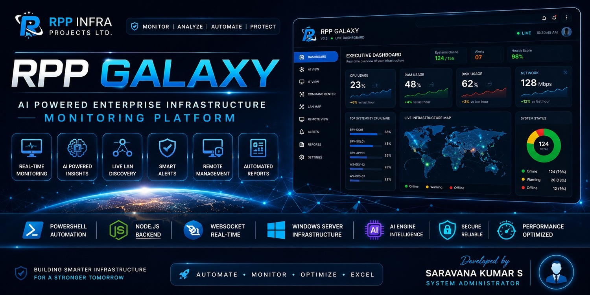
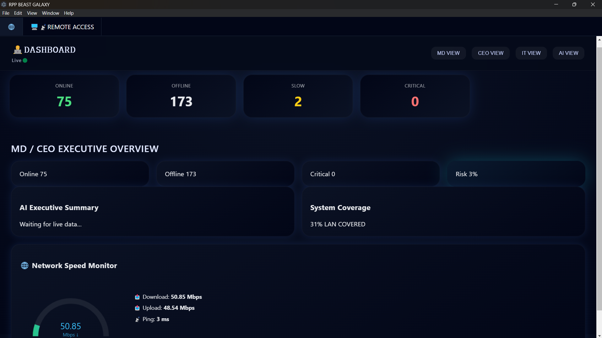
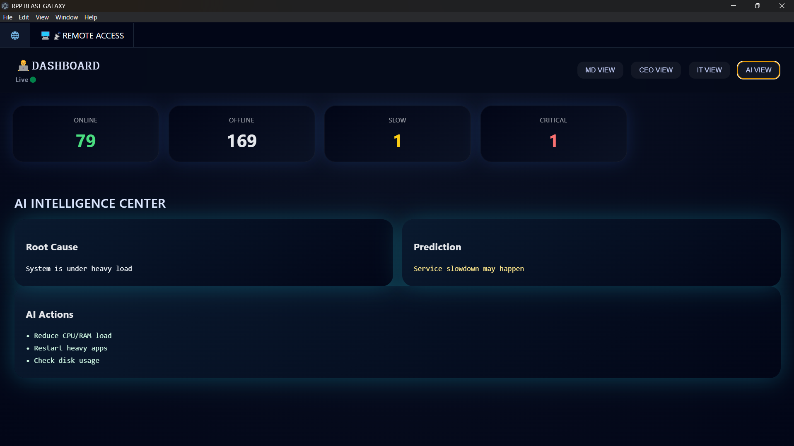
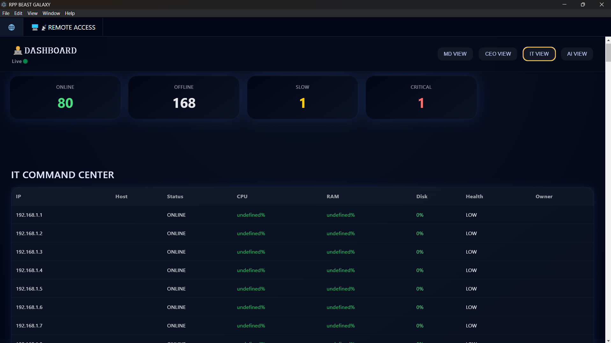
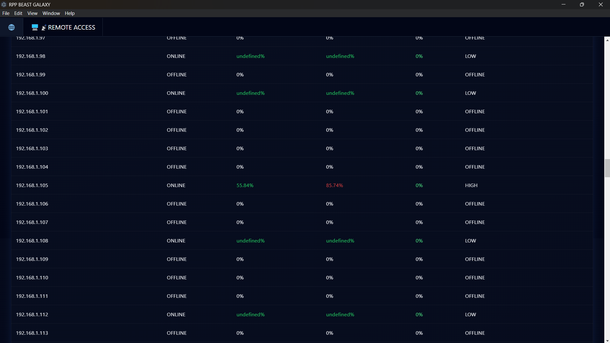
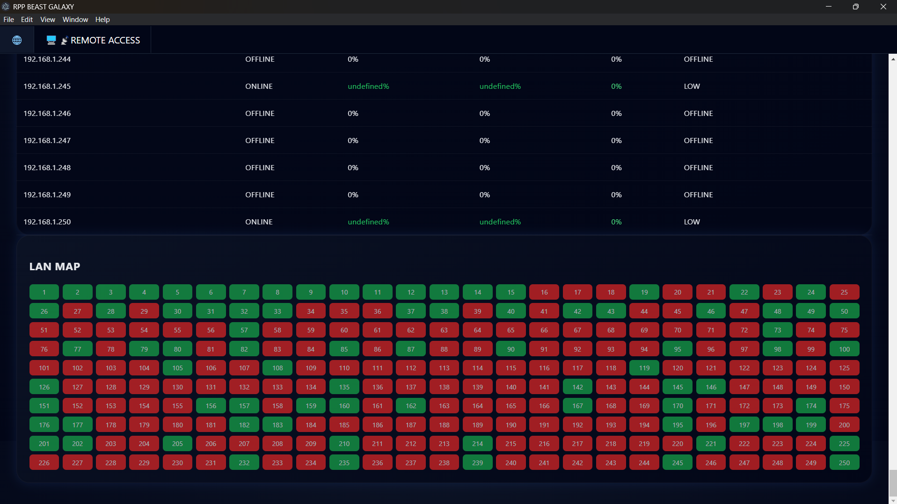
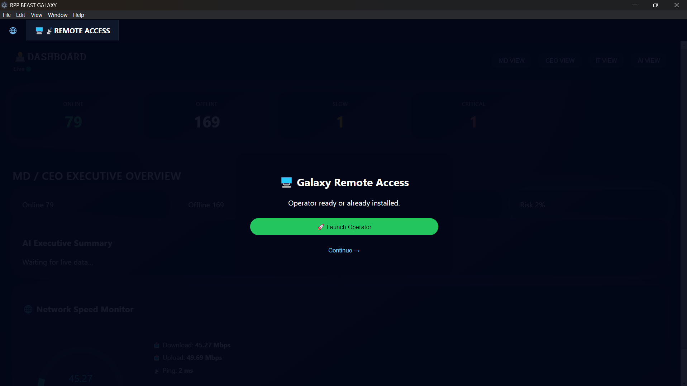

<p align="center">
  
</p>

<h1 align="center">🚀 RPP Galaxy</h1>

<h3 align="center">
AI-Powered Enterprise Infrastructure Monitoring Platform
</h3>

<p align="center">
Real-Time Monitoring • PowerShell Automation • Node.js • WebSocket • Enterprise Dashboard
</p>

<p align="center">


</p>

---

# 📖 Overview

RPP Galaxy is an enterprise IT infrastructure monitoring platform developed to centralize infrastructure visibility, system health monitoring, automation, and operational intelligence.

The platform combines PowerShell automation, Node.js services, WebSocket communication, and a modern web dashboard to deliver real-time monitoring, executive insights, and infrastructure management capabilities.

It is designed to help IT teams monitor enterprise systems, improve operational efficiency, and reduce incident response times.

---

# ✨ Key Features

- 🖥 Real-Time Infrastructure Monitoring
- 🌐 Live LAN Discovery
- ⚡ PowerShell Telemetry Agent
- 📊 Executive Dashboard
- 🤖 AI Executive Summary
- 📡 WebSocket Real-Time Communication
- 📈 Performance Analytics
- 🔒 Security Monitoring
- 🚨 Alert Engine
- 🗺 Interactive LAN Map
- 📁 Automated Reports
- ⚙ Infrastructure Automation
- 🖥 Remote Management Dashboard

---

# 📸 Dashboard Preview

## 🖥 Main Dashboard

Enterprise dashboard providing a real-time overview of infrastructure health, system status, and operational insights.



---

## 🤖 AI View

Displays AI-generated summaries, infrastructure insights, and recommendations.



---

## 💻 IT Operations View

Dedicated interface for IT administrators to monitor infrastructure and system performance.



---

## 🎯 IT Command Center

Centralized console for infrastructure administration and operational management.



---

## 🌐 Live LAN Map

Interactive network topology showing device connectivity and infrastructure status.



---

## 🖥 Remote Monitoring

Remote monitoring interface for enterprise infrastructure.



---

# 🏗 System Architecture

```
PowerShell Telemetry Agent
            │
            ▼
Telemetry Collection Engine
            │
            ▼
Node.js Backend Server
            │
            ▼
WebSocket Server
            │
            ▼
Enterprise Dashboard
      │      │      │
      ▼      ▼      ▼
   MD View  IT View AI View
```

---

# ⚙ Technology Stack

## Backend

- Node.js
- Express.js
- WebSocket

## Automation

- PowerShell
- Windows Task Scheduler

## Frontend

- HTML5
- CSS3
- JavaScript

## Infrastructure

- Windows Server
- Active Directory
- Microsoft 365
- DNS
- DHCP
- TCP/IP
- Networking

---

# 📂 Project Structure

```
RPP_GALAXY
│
├── Agent
│   ├── GalaxyTelemetryAgent.ps1
│   ├── GalaxyIdentityAgent.ps1
│   ├── GhostEngine.ps1
│   ├── AutoHealEngine.ps1
│   └── PerformanceBoostEngine.ps1
│
├── DesktopApp
│
├── SecurityAgent
│
├── Server
│   ├── public
│   ├── engines
│   ├── package.json
│   └── server.mjs
│
├── Reports
│
├── ServerData
│
├── Screenshots
│
├── docs
│   ├── Installation.md
│   ├── Architecture.md
│   ├── API.md
│   ├── Future-Roadmap.md
│   └── Release-Notes.md
│
├── README.md
└── LICENSE
```

---

# 🚀 Installation

Clone the repository

```bash
git clone https://github.com/saravanakumarofficial2003-collab/RPP-Galaxy.git
```

Navigate to the server

```bash
cd Server
```

Install dependencies

```bash
npm install
```

Start the server

```bash
node server.mjs
```

Open the dashboard

```
http://localhost:8090
```

or

```
http://YOUR-IP:8090
```

---

# 📖 Documentation

Complete project documentation is available in the **docs** directory.

- Installation Guide
- Architecture
- API Documentation
- Future Roadmap
- Release Notes

---

# 🛣 Future Roadmap

- Azure Monitoring
- AWS Monitoring
- Cloud Infrastructure Dashboard
- Mobile Dashboard
- Electron Desktop Client
- Email Notifications
- WhatsApp Notifications
- AI Prediction Engine
- Infrastructure Analytics
- Cloud Asset Discovery

---

# 📌 Current Capabilities

✅ Real-Time Monitoring

✅ Live Dashboard

✅ PowerShell Automation

✅ WebSocket Communication

✅ Enterprise LAN Monitoring

✅ AI Executive Dashboard

✅ Infrastructure Reporting

✅ Remote Monitoring

---

# 👨‍💻 Developer

## Saravana Kumar S

**System Administrator**

📍 Chennai, Tamil Nadu, India

### Expertise

- Windows Server Administration
- Active Directory
- Microsoft 365
- PowerShell Automation
- Networking
- IT Infrastructure
- System Administration
- Infrastructure Monitoring

**LinkedIn**

https://linkedin.com/in/saravanakumar-s

**GitHub**

https://github.com/saravanakumarofficial2003-collab

---

# ⭐ Support

If you find this project useful, consider giving it a ⭐ on GitHub.

---

# 📜 License

This project is licensed under the MIT License.

---

<p align="center">

Made with ❤️ by **Saravana Kumar S**

</p>